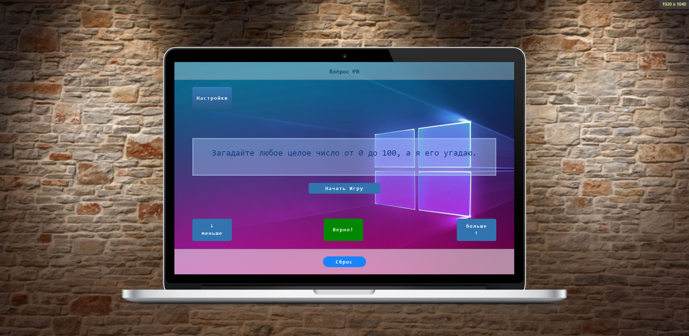

## 
8.7.-Practical-work

### 
Guessing game

#### 
 Это небольшая игра "Угадайка" написана в учебных целях.

Что применяется:

* document.querySelector
* addEventListener и removeEventListener
* Условное ветвление if
    * отрицание;
    * конъюнкция
    * дизъюнкция
* Тернарный оператор (в функции для преобразования чисел в текст)
* Метод массивов substr() и срезы
* function()
* .collapse (Bootstrap)

Число выводится в текстовой форме, если длина строки меньше или равна 20 символов, включая пробелы. Если число отрицательное, то добавляется текст "минус" (не входит в 20 символов).

Для того чтобы избежать некорректный ввод чисел пользователем, введены следующие проверки данных

- При вводе максимума или минимума больше 999 или меньше -999 изменять число на ближайшую границу (например, 1000 на 999, а -10000 на -999).

- Добавленна проверка на NaN (короткий цикл операций дизъюнкциине не используется по причине усложнения и добавления в программу дополнительных проверок)

- Для того чтобы не было делениея "0" добавлен проверка на "("input != (мин + макс = 0)"

- Проверка на Min > Max. 

#### 
Очень коротко.

Для коррекной работы программы при первом старте функции кнопок минимум , максимум и кнопки Верно недоступны.

Для начала игры нужно нажать кнопку Начать игру, после этого функция кнопки недоступна до окончания игры.

Кнопка Сброс возвращает установки по умолчанию в любой момент игры.

В разделе настройки можно установить значения минимального и максимального чисел, поумолчанию минимальное число 0 максимальное 100. После ввода чисел и нажатия кнопки Сохранить значения сохраняются, все остольные параметры по умолчанию.